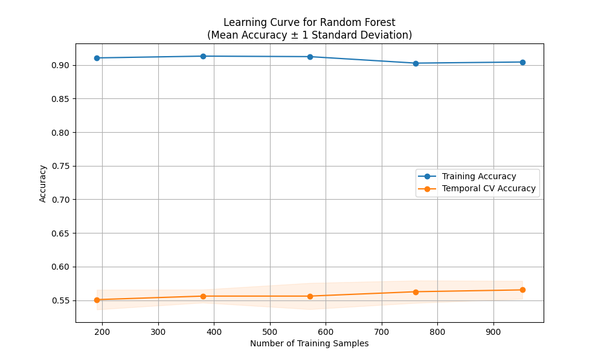
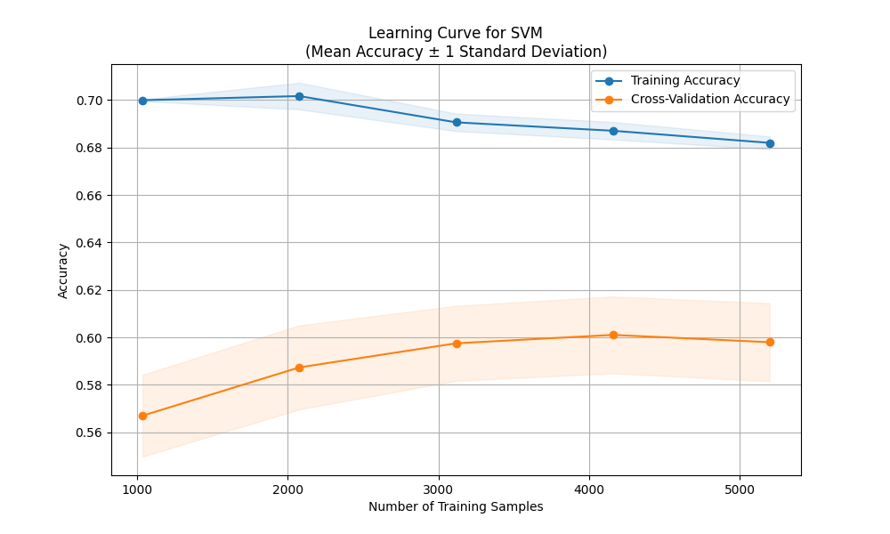
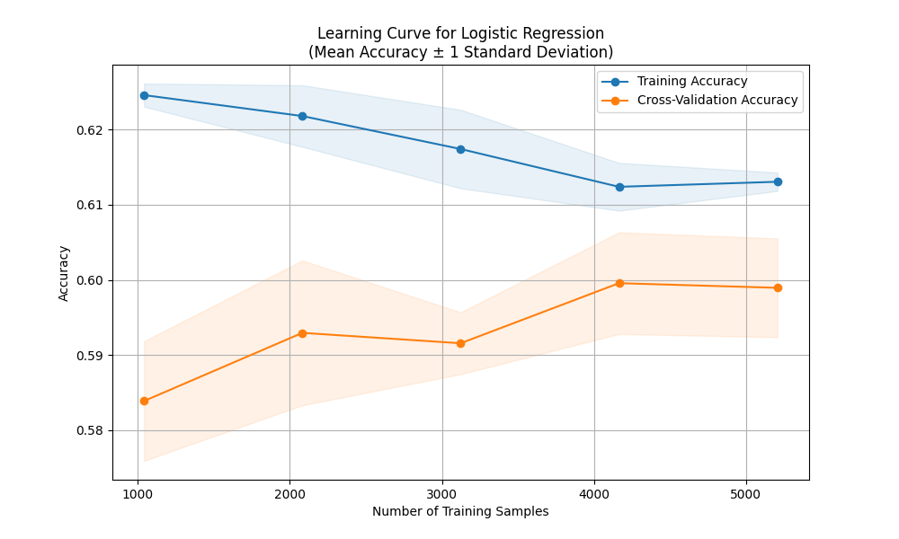
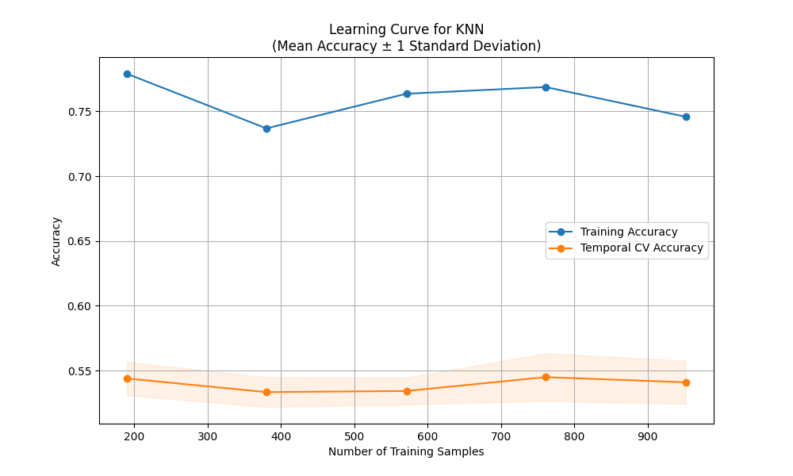
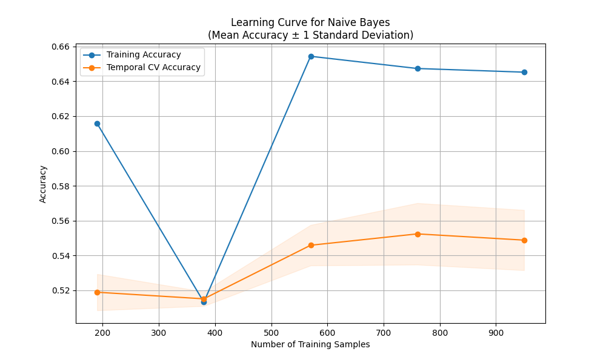
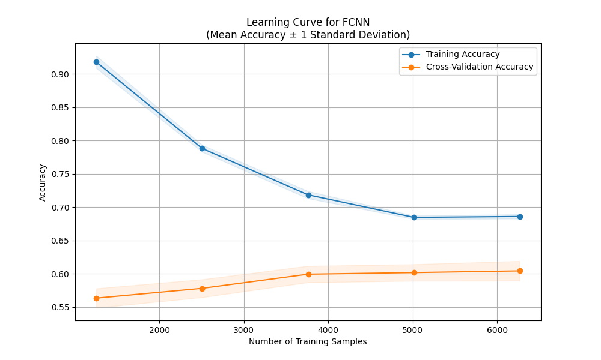
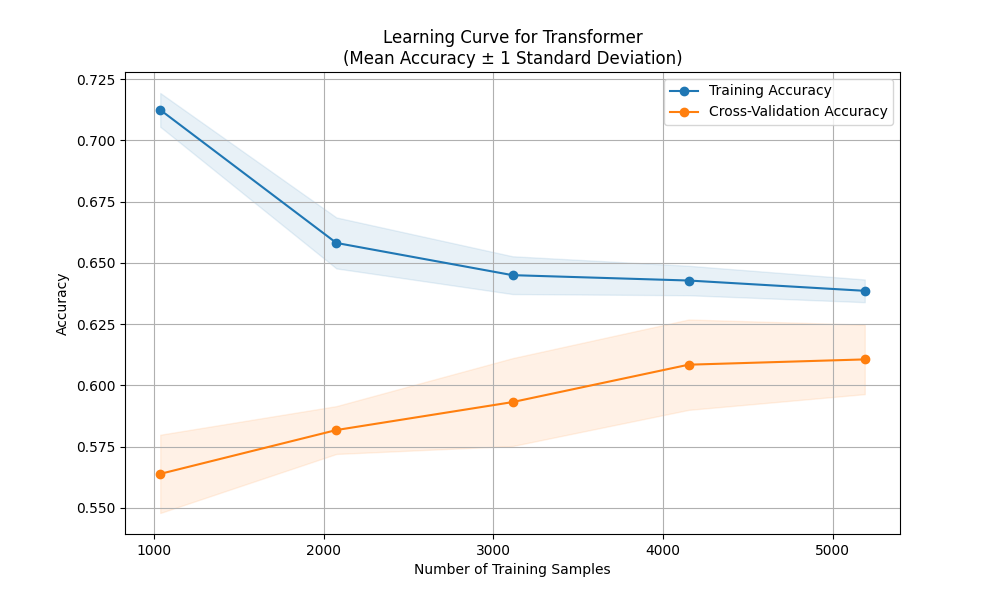

# MMA Predictive Modeling

A machine learning project for predicting fight outcomes in Mixed Martial Arts (MMA) events. This project leverages classical machine learning algorithms, neural networks, and ensemble methods to analyze fighter statistics and historical fight data to generate insights and visualizations.

## Current Status

✅ Ongoing – The project is functional and actively maintained. It is periodically updated with the latest fight data after events.

## Features

### Machine Learning Models

- **Classical ML:** K-Nearest Neighbors (KNN), Naive Bayes, Logistic Regression, Support Vector Machines (SVM), Decision Trees
- **Neural Networks:** Fully Connected Neural Network (FCNN), Transformers
- **Ensemble Methods:** Gradient Boosting, Random Forest

### Data Processing & Preprocessing

- Extracts fighter statistics, fight history, and event-based features
- Feature engineering for significant fight attributes such as striking accuracy, takedown success, and fight duration
- Handles missing data and normalizes input features

### Training & Evaluation

- Implements multiple machine learning models for comparison
- Trains models using UFC fight data
- Generates learning curve plots
- Evaluates models with accuracy metrics and classification reports

## Development Notes

- Written in Python using Scikit-learn and PyTorch
- Data stored in structured CSV format for easy updates
- Outputs include predictive plots and model performance summaries

## Updating the Dataset

New fight event data is added periodically to keep the model updated. The pipeline processes new event data, retrains models, and generates updated performance evaluations.

## Contributing

🔒 Currently a solo project – external contributions are not planned at this time.

## Results

