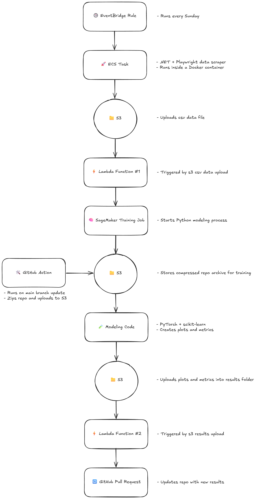
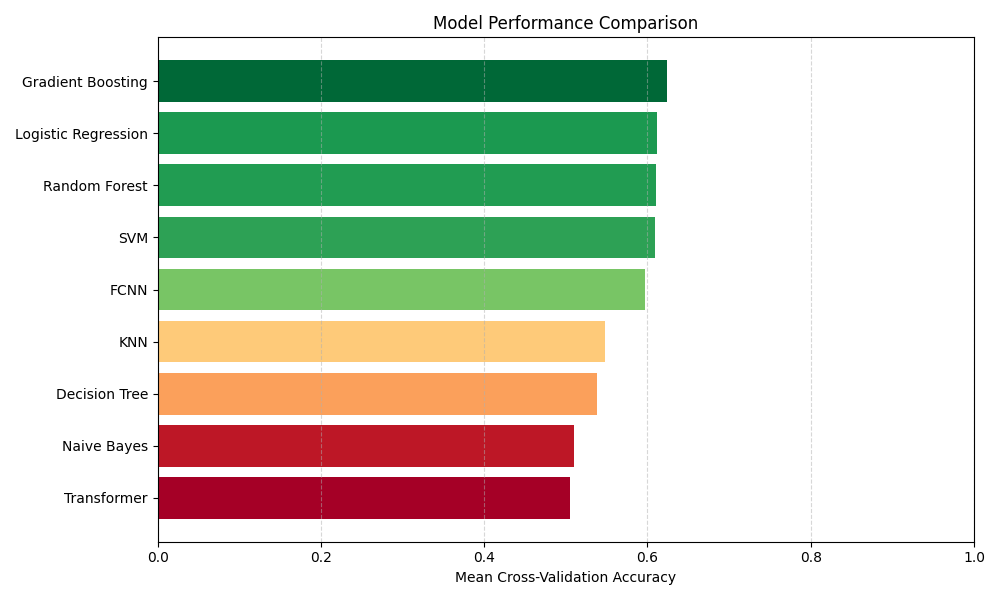
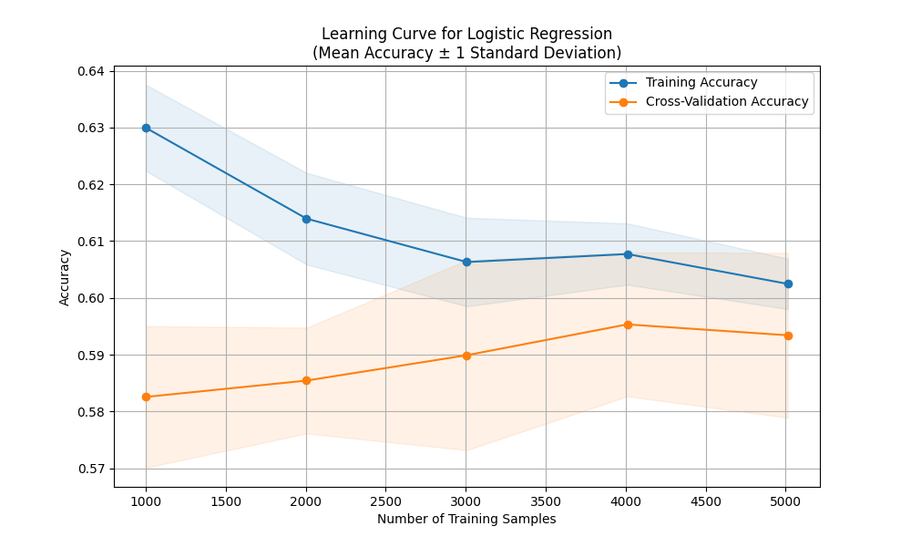

# MMA Predictive Modeling

A machine learning project for predicting fight outcomes in Mixed Martial Arts (MMA) events. This project leverages classical machine learning algorithms, neural networks, and ensemble methods to analyze fighter statistics and historical fight data to generate insights and visualizations.

The project is implemented in Python, utilizing both Scikit-learn and PyTorch for model development. All data is maintained in a structured CSV format, enabling straightforward updates and management. The outputs include a model comparison plot, learning curve plots, and detailed classification reports.

## The Challenge of MMA Fight Prediction

MMA fight prediction is, in theory, a well-posed input-output problem: given data, output a prediction (e.g., Fighter A wins or Fighter B wins). Any function, even a random one, can technically provide a prediction, so the problem is not mathematically undecidable.

Technically, MMA fight prediction is a probabilistic classification problem under noisy and incomplete information. While finding the optimal predictor may be NP-hard or worse, it is not undecidable. The problem is best understood through the lens of statistical learning theory (how well we can approximate a solution with limited, noisy data) rather than computability theory (the limits of what computers can compute).

However, in practice, accurate fight prediction is extremely challenging. Real-world outcomes depend on human behavior (which is non-deterministic and chaotic), incomplete data (such as injuries, mindset, or training changes), and inherent randomness (like lucky punches or judging errors). This introduces uncertainty and irreducible complexity, making perfect prediction impossible.

MMA fight prediction is solvable in theory (a model can always make a prediction), but it is practically intractable to solve perfectly. No model can guarantee perfect accuracy due to real-world randomness and incomplete information.

## Project Overview

### Machine Learning Models

- **Classical ML:** K-Nearest Neighbors (KNN), Naive Bayes, Logistic Regression, Support Vector Machines (SVM), Decision Trees
- **Neural Networks:** Fully Connected Neural Network (FCNN), Transformers
- **Ensemble Methods:** Gradient Boosting, Random Forest

### Data Processing & Preprocessing

- Extracts fighter statistics, fight history, and event-based features
- Feature engineering for significant fight attributes such as striking accuracy, takedown success, and fight duration
- Handles missing data and normalizes input features

### Training & Evaluation

- Implements multiple machine learning models for comparison
- Trains models using fight event data
- Generates learning curve plots
- Evaluates models with accuracy metrics and classification reports

## Automated Training & Deployment Pipeline

This project includes a fully automated pipeline that handles data ingestion, model training, result generation, and repository updates. It scrapes the latest MMA event data, retrains all models, generates visualizations and evaluation metrics, and pushes the updated results to GitHub - all with no manual intervention.

**Pipeline Overview:**

1. **EventBridge Rule** triggers every Sunday.
2. **ECS Task** runs a .NET + Playwright data scraper inside a Docker container.
3. Scraped data is uploaded to **S3** as a CSV file.
4. An **S3-triggered Lambda** starts a **SageMaker training job**.
5. The job runs **Python modeling code** using PyTorch + scikit-learn, and generates metrics and plots.
6. Results are uploaded to **S3** in a `results/` folder.
7. Another **Lambda function** detects the results and creates a **GitHub Pull Request** with the updated output.

## Results

