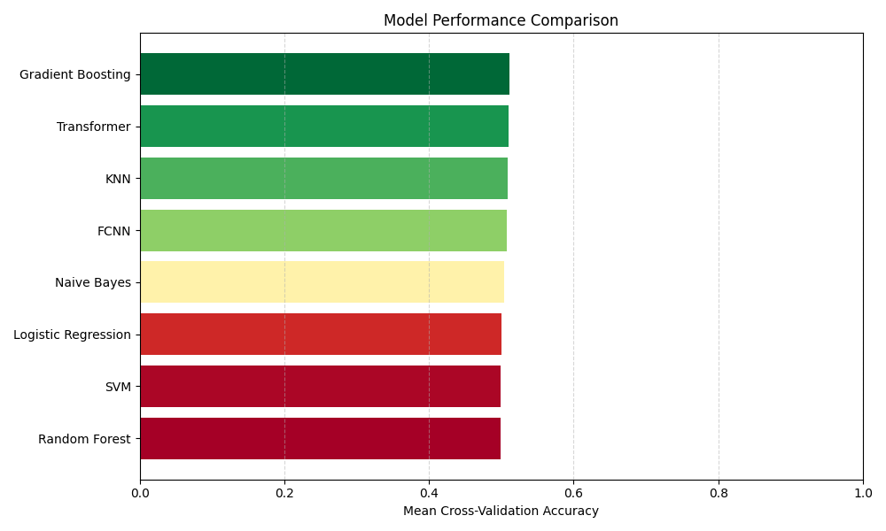

<!--
## Experiment Name (A short, descriptive title for the experiment).

Briefly explain the motivation, hypothesis, and setup for the experiment. What question are you trying to answer or what are you testing?

**Results:**
Summarize the key findings and metrics. Include relevant plots, tables, or images.

**Discussion:**
Interpret the results, discuss implications, limitations, and possible next steps or follow-up experiments.
-->

# Experiments

## Table of Contents

- [Scalar Normalization](#scalar-normalization)
- [SGD Optimizer with Momentum on Neural Networks](#sgd-optimizer-with-momentum-on-neural-networks)

This file documents structured machine learning experiments. Each entry includes the experiment name, a description of the setup and motivation, results with key metrics and visuals, and a discussion of findings, limitations, and next steps. This format supports reproducibility, comparison, and ongoing project development.

## Scalar Normalization

Scalar normalization (such as standardization or min-max scaling) ensures that all input features are on a comparable scale, which is especially important for distance-based models (like KNN), gradient-based optimizers (neural networks), and regularized models. To assess the impact of normalization, I trained all models with and without applying scalar normalization to the input features and compared their performance.

**Results:**

During data preprocessing, omitting scalar normalization consistently led to approximately a 10% decline in accuracy across all models.

**Discussion:**

Models trained on unnormalized data struggled to learn meaningful patterns, likely due to imbalanced feature influence and unstable gradients. Without normalization, features with larger numeric ranges can dominate the learning process, resulting in suboptimal performance and poor convergence. The observed accuracy drop highlights the crucial role of normalization in ensuring model effectiveness across both classical ML and deep learning approaches. These findings underscore that normalization is not just beneficial but essential for reliable, stable, and comparable model performance in the MMA prediction task.

## SGD Optimizer with Momentum on Neural Networks

To better understand the impact of optimizer choice on model performance and training dynamics, I replaced the Adam optimizer with Stochastic Gradient Descent (SGD) with momentum (momentum=0.9, learning_rate=0.01) in both the fully connected neural network (FCNN) and Transformer architectures. All other hyperparameters and data preprocessing steps (including scalar normalization) were kept constant to isolate the effect of the optimizer.

The motivation for this experiment is to observe how a simpler, more interpretable optimizer like SGD compares to Adam in terms of convergence behavior, final accuracy, and generalization. Adam is known for fast convergence due to its adaptive learning rates, while SGD can sometimes generalize better with careful tuning.

**Results:**

**Discussion:**
