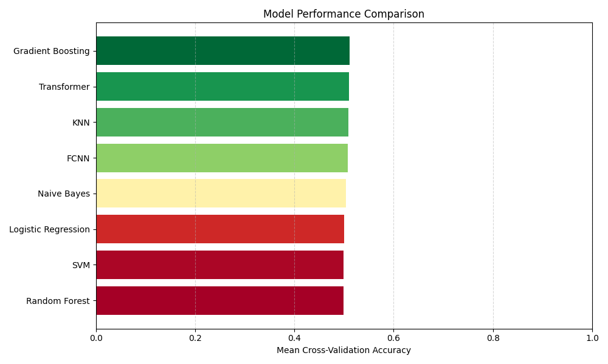

<!--
## Entry

A quick summary or thoughts for the day.

### Visuals

### Next Steps
Ideas or plans for future actions.
-->

# Notes

This file is a working journal for experiments, results, and iterative ideas. It serves as a flexible space to document hypotheses, record outcomes, capture visuals, and jot down next steps. Content may range from quick observations to structured experiment logs, aiding both exploration and ongoing project development.

## Remove Scalar Normalization

During data preprocessing, omitting scalar normalization consistently led to approximately a 10% decline in accuracy across all models.

### Visuals

